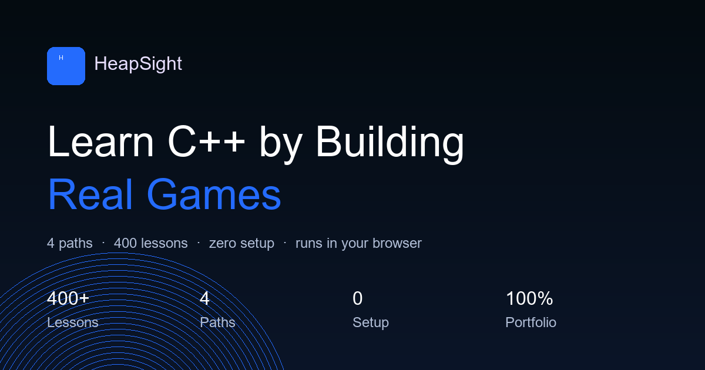
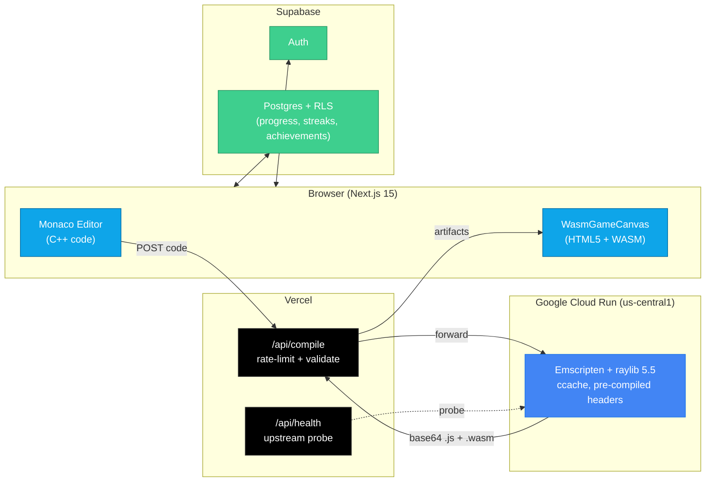

<div align="center">



# HeapSight

**Learn C++ game development by shipping real games in your browser.**

Write C++. Compile to WebAssembly server-side. Watch your game run live on canvas — no local toolchain, no setup, no friction.

[](https://nextjs.org)
[](https://www.typescriptlang.org)
[](https://tailwindcss.com)
[](https://supabase.com)
[](https://cloud.google.com/run)
[](https://www.raylib.com)

[Live Demo](https://heapsight.com) · [Report a Bug](https://github.com/Auth3nticAI/heapsight/issues) · [Request a Feature](https://github.com/Auth3nticAI/heapsight/issues)

</div>

---

## Why HeapSight?

Most C++ tutorials stop at `Hello, World` in a terminal. HeapSight starts where game development actually begins: on a canvas, with a loop, with collisions and particles and player input. You write idiomatic C++ with raylib — the same code you'd write on your desktop — and it runs in the browser via WebAssembly in under five seconds.

No `#ifdef PLATFORM_WEB`. No SDK downloads. No build errors from a mismatched toolchain. Just code, click **Run**, and see your game.

---

## Features

<table>
<tr>
<td width="50%" valign="top">

### Live C++ &rarr; WASM pipeline
Emscripten + a pre-compiled `libraylib.a` baked into a Docker image, with `ccache` pre-warmed and a `raylib.h` precompiled header. Target latency: **2&ndash;5 seconds** per compile.

</td>
<td width="50%" valign="top">

### Four learning paths
RPG, Platformer, Space Shooter, and Dungeon Crawler (3D) &mdash; each with a curated curriculum that scaffolds from `cout` output to full game loops.

</td>
</tr>
<tr>
<td width="50%" valign="top">

### AI error explainer
Pro users get natural-language explanations of compiler errors via Groq &mdash; "you forgot a semicolon after the struct" instead of `error: expected ';' at end of declaration`.

</td>
<td width="50%" valign="top">

### Progress that sticks
Streaks, achievements, XP, leaderboards, and shareable path-completion certificates at `/certificate/[id]`.

</td>
</tr>
<tr>
<td width="50%" valign="top">

### GitHub auto-commit
Connect your GitHub account once. Every completed lesson is pushed to a dedicated repo automatically &mdash; your portfolio writes itself.

</td>
<td width="50%" valign="top">

### Pro via Polar
Free tier unlocks the first ~14 lessons per path. Pro unlocks everything plus the AI tutor, billed monthly or yearly through [Polar](https://polar.sh).

</td>
</tr>
</table>

---

## Architecture



---

## Learning Paths

| Path | Canvas | Lessons | Focus |
|---|---|---|---|
| **RPG** | 640&nbsp;&times;&nbsp;640 | ~100 | Top-down movement, grids, inventory, dialog |
| **Platformer** | 800&nbsp;&times;&nbsp;450 | ~100 | Gravity, jumping, tile collisions, enemies |
| **Space Shooter** | 800&nbsp;&times;&nbsp;450 | ~100 | Vectors, projectiles, waves, power-ups |
| **Dungeon Crawler** | 800&nbsp;&times;&nbsp;600 | ~70 | 3D camera, cubes, procedural rooms |

---

## Compile Pipeline

<details>
<summary><b>Click to expand the hot path</b></summary>

1. User clicks **Run**; frontend calls `compileWithWasm()` in `src/lib/cpp-runner.ts`.
2. `POST /api/compile` &mdash; validates (code &lt; 50&nbsp;KB, valid path, rate-limited 10&nbsp;req/min/IP) and forwards to Cloud Run.
3. Cloud Run compiles with Emscripten:
   ```
   -O1 -std=c++17 -DPLATFORM_WEB -DGRAPHICS_API_OPENGL_ES2
   -sUSE_GLFW=3 -sASYNCIFY -sALLOW_MEMORY_GROWTH=1
   -sMODULARIZE=1 -sEXPORT_ES6=1 -sGL_ENABLE_GET_PROC_ADDRESS
   -sEXPORTED_RUNTIME_METHODS=['print','printErr']
   ```
4. Returns base64-encoded `.js` + `.wasm` artifacts (stored in Zustand).
5. `WasmGameCanvas.tsx` &rarr; decode base64 &rarr; Blob URLs &rarr; dynamic `import()` &rarr; render to `<canvas>`.
6. `cout` captured via `print` / `printErr` callbacks &rarr; validated against expected test output.
7. Lesson is marked complete on pass; confetti fires; next lesson unlocks.

**Why ASYNCIFY?** Students write normal blocking `while(!WindowShouldClose())` loops. ASYNCIFY yields back to the browser event loop without any `#ifdef PLATFORM_WEB` guards &mdash; so the same source runs on desktop and web.

</details>

---

## Tech Stack

<div align="center">

| Layer | Technology |
|---|---|
| **Frontend** | Next.js 15 (App Router), TypeScript, Tailwind CSS |
| **Editor** | Monaco (`@monaco-editor/react`) |
| **Runtime** | WebAssembly, HTML5 Canvas |
| **State** | Zustand |
| **Auth &amp; DB** | Supabase (Postgres + RLS) |
| **Compiler** | Emscripten, raylib 5.5, Docker, `ccache` |
| **Hosting** | Vercel (frontend) + Cloud Run (compiler) |
| **Payments** | Polar |
| **AI Tutor** | Groq (Llama 3.1) |
| **Analytics** | PostHog |
| **3D** | Three.js (`@react-three/fiber`, `@react-three/drei`) |

</div>

---

## Prerequisites

Install these before running the code:

| Software | Version | Why | Install |
|---|---|---|---|
| **Node.js** | &ge;&nbsp;18.17 | Runs Next.js | [nodejs.org](https://nodejs.org) |
| **npm** | &ge;&nbsp;9 | Bundled with Node.js | &mdash; |
| **Git** | any | Clone the repo | [git-scm.com](https://git-scm.com) |
| **Docker Desktop** | latest | Only if you want to run the C++&rarr;WASM compiler locally | [docker.com](https://www.docker.com/products/docker-desktop) |

You'll also need free accounts to get API keys:

- **Supabase** ([supabase.com](https://supabase.com)) &mdash; auth + database (required)
- **Groq** ([console.groq.com](https://console.groq.com)) &mdash; AI error explainer (optional)
- **Polar** ([polar.sh](https://polar.sh)) &mdash; payments (optional)
- **PostHog** ([posthog.com](https://posthog.com)) &mdash; analytics (optional)

---

## Quick Start

```bash
# 1. Clone
git clone https://github.com/Auth3nticAI/heapsight.git
cd heapsight

# 2. Install
npm install

# 3. Configure env (see Configuration section below)
cp .env.example .env.local
# then edit .env.local with YOUR keys

# 4. Run the dev server
npm run dev
```

Open [http://localhost:3000](http://localhost:3000).

To build and run in production mode:

```bash
npm run build
npm run start
```

---

## Configuration

After cloning, you **must** update `.env.local` with your own credentials. The repo's example values will not work for you.

### Required variables &mdash; update these

```bash
# Your Supabase project URL (from Supabase dashboard > Settings > API)
NEXT_PUBLIC_SUPABASE_URL=https://<your-project-ref>.supabase.co

# Your Supabase anon/public key (same dashboard page)
NEXT_PUBLIC_SUPABASE_ANON_KEY=<your-anon-key>

# Your Supabase service role key (for admin operations)
SUPABASE_SERVICE_ROLE_KEY=<your-service-role-key>

# URL of the compile service (see "Running the compiler" below)
COMPILE_SERVICE_URL=http://localhost:8080
```

### Optional variables

```bash
GROQ_API_KEY=<your-groq-key>              # AI error explainer
POLAR_ACCESS_TOKEN=<your-polar-token>     # Pro payments
POLAR_WEBHOOK_SECRET=<your-webhook-secret>
NEXT_PUBLIC_POSTHOG_KEY=<your-posthog-key>
```

### Database setup

After creating your Supabase project, run the SQL migrations in order against your database:

```bash
# In the Supabase SQL editor, paste and run each file:
sql/001-retention-features.sql
sql/002-security-fixes.sql
```

These create the tables (`profiles`, `lesson_progress`, `user_streaks`, `user_achievements`, `daily_activity`, ...) and the Row Level Security policies.

### Running the compiler locally

The C++ &rarr; WASM compiler runs as a separate Docker service:

```bash
cd compiler
docker build -t heapsight-compiler .
docker run -p 8080:8080 heapsight-compiler
```

Then set `COMPILE_SERVICE_URL=http://localhost:8080` in `.env.local`.

If you don't want to run the compiler locally, you can point `COMPILE_SERVICE_URL` at any public build of the `compiler/` image (e.g. on Google Cloud Run).

---

## API Surface

| Route | Method | Purpose |
|---|---|---|
| `/api/compile` | `POST` | Proxy C++ &rarr; Cloud Run; retries cold-start 503 |
| `/api/health` | `GET` | Upstream compiler probe (safe to poll) |
| `/api/ai-tutor/explain-error` | `POST` | Groq-powered error explanation (Pro) |
| `/api/github/*` | &mdash; | OAuth connect, commit, disconnect |
| `/api/polar/*` | &mdash; | Checkout, webhook, verify, cancel |
| `/api/certificate/[path]` | `POST` | Generate path-completion certificate |
| `/api/export` | `POST` | Download all lesson code as a ZIP |
| `/api/referral/*` | `POST` | Generate &amp; process referral codes |

---

## Project Structure

```
heapsight/
  compiler/              Docker image: Emscripten + raylib + ccache
    Dockerfile
    server.js            Express: POST /compile, GET /health
    compile.sh           Student code -> game.js + game.wasm
    headers/             Per-path public headers (hs_render.h, hs_types.h)
  src/
    app/
      api/               16 API routes (compile, health, github, polar...)
      (dashboard)/       learn, progress, leaderboard, account
      lesson/[id]/       Lesson player (split view)
    components/
      WasmGameCanvas.tsx   Core WASM renderer
      GameCanvasWrapper.tsx
    data/lessons/        ~370 lessons across 4 paths
    lib/                 cpp-runner, achievement-manager, posthog, ...
    store/               Zustand stores
  sql/                   Schema + RLS policies
  public/                Static assets (og-image, sitemap)
```

---

## Status

| | |
|---|---|
| **Live** | [heapsight.com](https://heapsight.com) |
| **Version** | 0.1.0 |
| **Lessons shipped** | ~370 across 4 paths |
| **Compile target** | 2&ndash;5 s (p50), 15 s hard timeout |
| **Code size limit** | 50 KB per request |

---

## Roadmap

- [ ] Roguelike path lessons (path exists, curriculum pending)
- [ ] AI Sandbox path integration in learn tree
- [ ] Persistent rate limiter (Redis &mdash; current in-memory resets on cold start)
- [ ] Encrypt GitHub access tokens at rest
- [ ] Content Security Policy + X-Frame-Options headers
- [ ] Mobile editor (currently read-only on small screens)

---

## License

Proprietary &mdash; all rights reserved. Contact [tray.d.branch@gmail.com](mailto:tray.d.branch@gmail.com) for licensing inquiries.

---

<div align="center">

Built by [Tray Branch](https://github.com/Auth3nticAI) &middot; Powered by Emscripten, raylib, and a lot of `ccache`.

</div>
